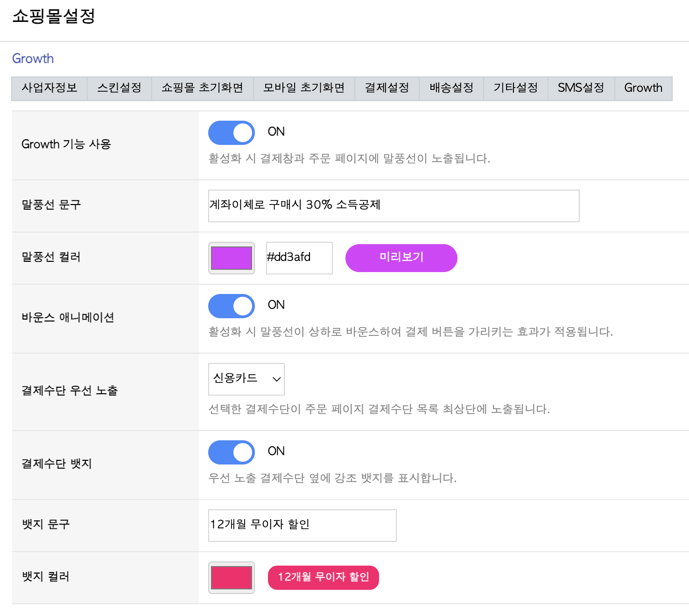

# YoungCart5 Growth Plugin

그누보드5 영카트 쇼핑몰을 위한 결제수단 프로모션 플러그인입니다.
코어 파일 수정 없이 모든 테마/스킨에서 작동합니다.

## 스크린샷

### 관리자 설정 페이지


### 상품 페이지 - 바로구매 버튼 위 말풍선


### 주문 페이지 - 결제수단 1열 레이아웃, 뱃지, 말풍선


## 주요 기능

- **말풍선**: 바로구매/주문하기 버튼 위에 프로모션 말풍선 표시
- **말풍선 커스터마이징**: 문구, 색상, 바운스 애니메이션 설정
- **결제수단 1열 레이아웃**: 주문 페이지 결제수단을 세로 1열로 변경
- **결제수단 우선배치**: 특정 결제수단을 최상단에 배치
- **뱃지**: 우선배치된 결제수단에 강조 뱃지 표시 (문구, 색상 설정)

## 설치 방법

### 1. 파일 복사

```
영카트5 루트/
├── extend/
│   └── growth.extend.php     ← extend 폴더에 복사
└── plugin/
    └── growth/               ← plugin 폴더에 복사
        ├── admin.php
        ├── growth.js
        └── growth.css
```

### 2. 관리자 설정

브라우저에서 접속:

```
https://사이트주소/plugin/growth/admin.php
```

또는 관리자 페이지 > 쇼핑몰관리 사이드바에 자동 추가되는 **Growth** 링크를 클릭합니다.

### 3. 설정 및 활성화

Growth 사용을 ON으로 설정하고 저장하면 즉시 적용됩니다.

## 요구 사항

- 그누보드5 영카트 5.4 이상
- PHP 7.0 이상 (PHP 8.x 호환)
- MySQL 5.6 이상

## 작동 원리

- `extend/growth.extend.php`: 그누보드5의 `common.php`에 의해 자동 로드됩니다. `tail_sub` 훅을 통해 쇼핑몰 페이지에 JS/CSS를 삽입합니다.
- `plugin/growth/growth.js`: 프론트엔드에서 DOM을 탐지하여 말풍선, 결제수단 재정렬, 뱃지를 동적으로 생성합니다.
- `plugin/growth/growth.css`: 바운스 애니메이션, 1열 레이아웃, 뱃지 스타일을 정의합니다.
- `plugin/growth/admin.php`: 독립 관리자 페이지로 모든 설정을 관리합니다.
- DB 테이블(`g5_growth_config`)은 최초 실행 시 자동 생성됩니다.

## 삭제 방법

1. `extend/growth.extend.php` 파일 삭제
2. `plugin/growth/` 폴더 삭제
3. DB에서 `g5_growth_config` 테이블 삭제 (선택)

```sql
DROP TABLE IF EXISTS g5_growth_config;
```

## 라이선스 및 배포 시 준수 사항

### 라이선스

본 플러그인은 MIT License로 배포됩니다.

### 그누보드5 라이선스 관련 준수 사항

본 플러그인은 LGPL 2.1 라이선스로 배포되는 그누보드5 영카트의 hook/extend API를 사용합니다.
LGPL 2.1 제5조~제6조에 따라 본 플러그인은 "라이브러리를 사용하는 저작물"에 해당하며, 독립적인 라이선스로 배포가 가능합니다.

배포 시 다음 사항을 준수해야 합니다:

| 항목 | 내용 |
|------|------|
| **LGPL 고지** | 본 플러그인이 LGPL 2.1 라이선스의 그누보드5 영카트를 사용한다는 사실을 명시해야 합니다. |
| **개작 허용** | 사용자가 그누보드5 라이브러리 부분을 자유롭게 수정할 수 있어야 합니다. 플러그인이 이를 제한해서는 안 됩니다. |
| **LGPL 사본 제공** | LGPL 2.1 원문을 참조할 수 있는 방법을 제공해야 합니다. (https://www.gnu.org/licenses/old-licenses/lgpl-2.1.html) |
| **코어 미포함** | 그누보드5의 코어 소스 코드를 플러그인에 포함하여 배포해서는 안 됩니다. |

### LGPL 2.1 고지

> This plugin uses GnuBoard5 YoungCart, which is distributed under the GNU Lesser General Public License v2.1.
> A copy of the LGPL 2.1 is available at: https://www.gnu.org/licenses/old-licenses/lgpl-2.1.html
>
> 본 플러그인은 GNU 약소 일반 공중 사용 허가서(LGPL) 2.1판으로 배포되는 그누보드5 영카트를 사용합니다.
> LGPL 2.1 전문: https://www.gnu.org/licenses/old-licenses/lgpl-2.1.html
